# 📐 Sơ đồ Kiến trúc & Flow thực thi chính

> **Dự án**: IoT Device Management Platform  
> **Phiên bản**: 1.0  
> **Cập nhật**: 2026-08-24

---

## 1. Kiến trúc tổng thể hệ thống

### 1.1 Sơ đồ kiến trúc High-Level

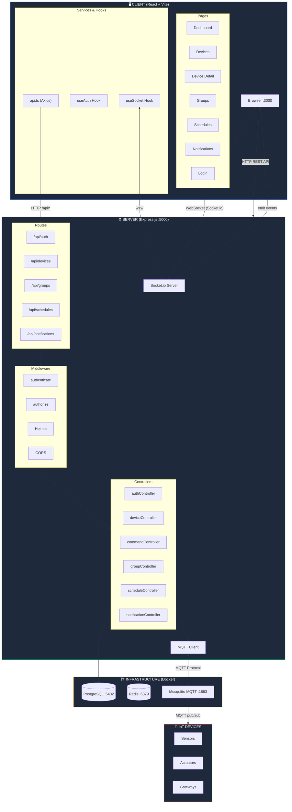

### 1.2 Sơ đồ triển khai (Deployment)

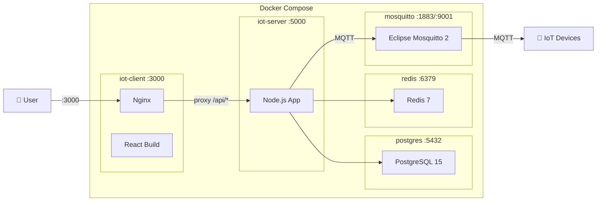

---

## 2. Kiến trúc Backend chi tiết

### 2.1 Layer Architecture

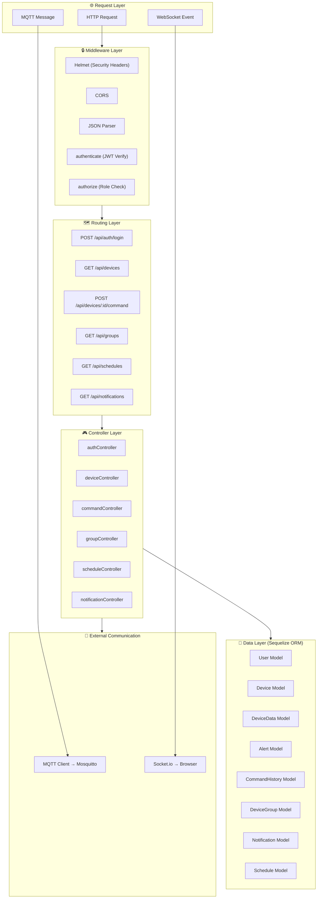

### 2.2 Database Schema (ERD)

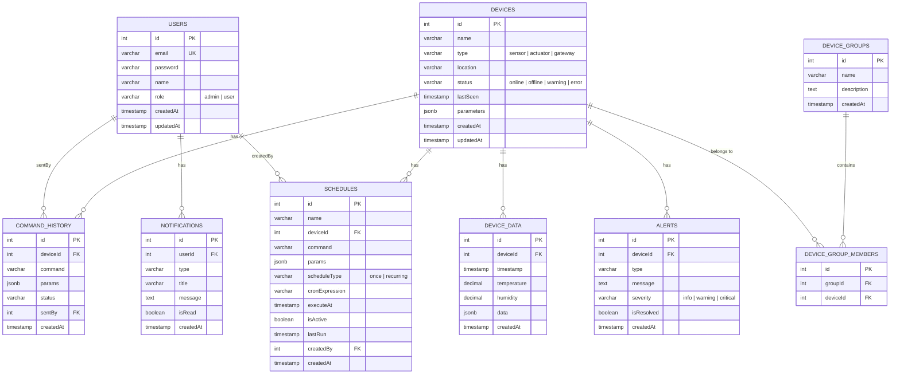

---

## 3. Kiến trúc Frontend chi tiết

### 3.1 Component Tree

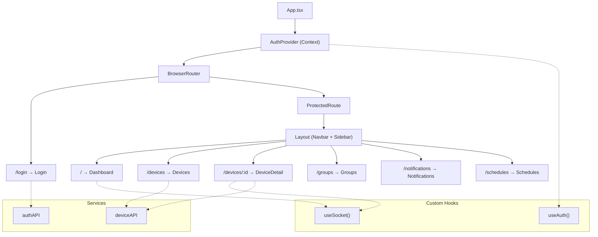

### 3.2 State Management Flow

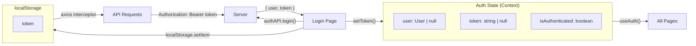

---

## 4. Flow thực thi chính

### 4.1 Flow Đăng nhập (Authentication)

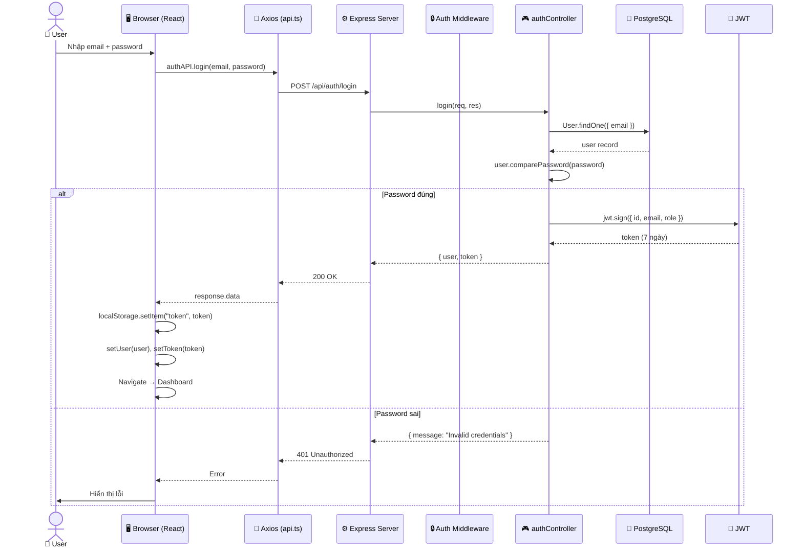

### 4.2 Flow Xem danh sách thiết bị

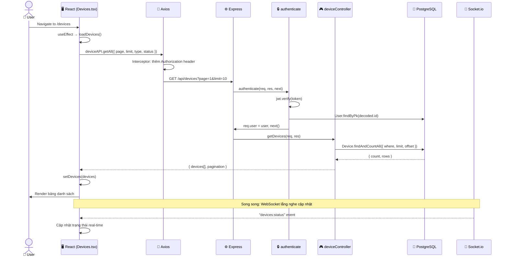

### 4.3 Flow Điều khiển thiết bị (Turn On/Off) ⭐

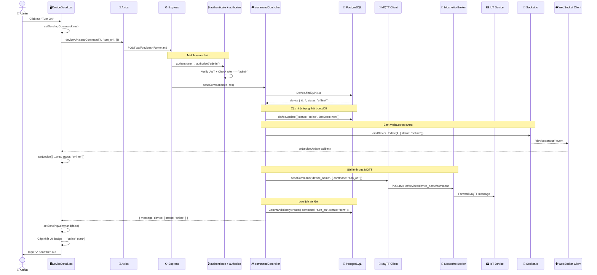

### 4.4 Flow Nhận dữ liệu Real-time từ IoT Device

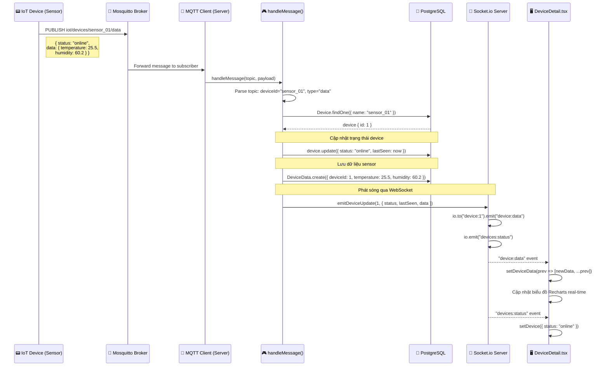

### 4.5 Flow Lên lịch tự động (Schedule)

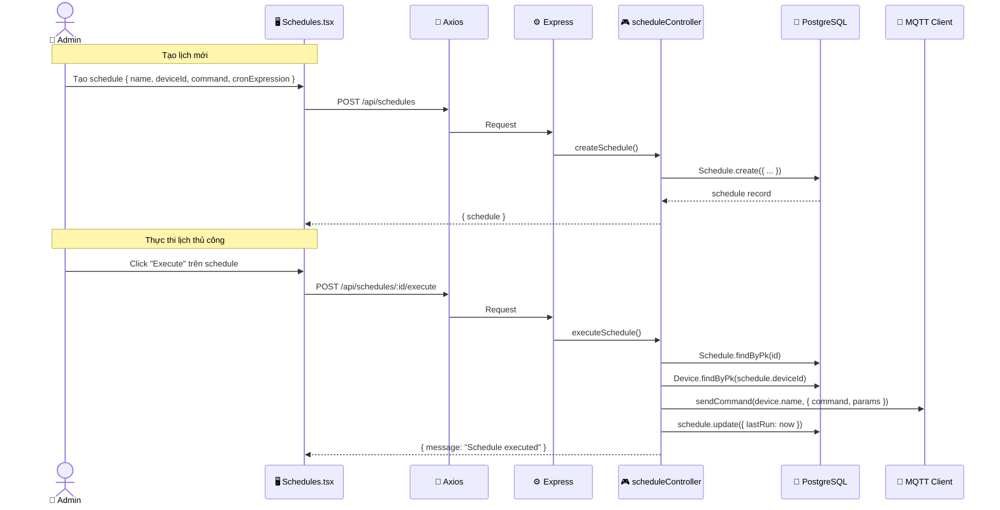

---

## 5. Luồng dữ liệu tổng hợp

### 5.1 Data Flow Overview

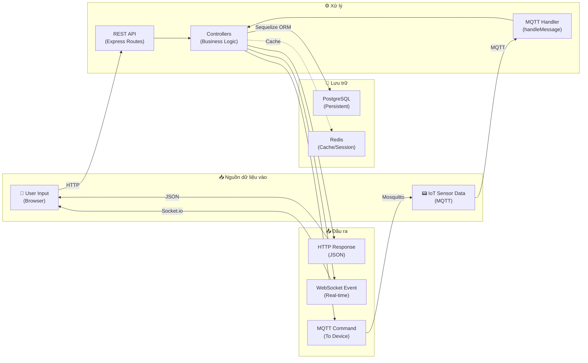

### 5.2 Giao thức truyền thông

| Kênh | Giao thức | Hướng | Mục đích |
|------|-----------|-------|----------|
| Browser ↔ Server | HTTP REST | Request/Response | CRUD operations, Authentication |
| Browser ↔ Server | WebSocket (Socket.io) | Bidirectional | Real-time updates, Device status |
| Server ↔ Mosquitto | MQTT | Pub/Sub | Send commands, Receive sensor data |
| IoT Device ↔ Mosquitto | MQTT | Pub/Sub | Publish sensor data, Receive commands |

### 5.3 MQTT Topic Structure

```
iot/devices/
├── {device_name}/
│   ├── data        ← IoT device publishes sensor data here
│   └── command     ← Server publishes commands here
└── #               ← Server subscribes to all sub-topics
```

| Topic Pattern | Publisher | Subscriber | Payload |
|---------------|----------|------------|---------|
| `iot/devices/{name}/data` | IoT Device | Server | `{ status, data: { temperature, humidity } }` |
| `iot/devices/{name}/command` | Server | IoT Device | `{ command, params, timestamp }` |

---

## 6. Bảo mật & Middleware Pipeline

### 6.1 Request Processing Pipeline

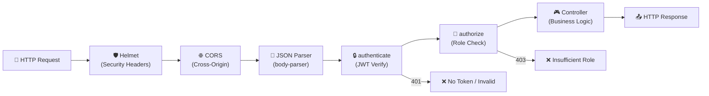

### 6.2 WebSocket Authentication

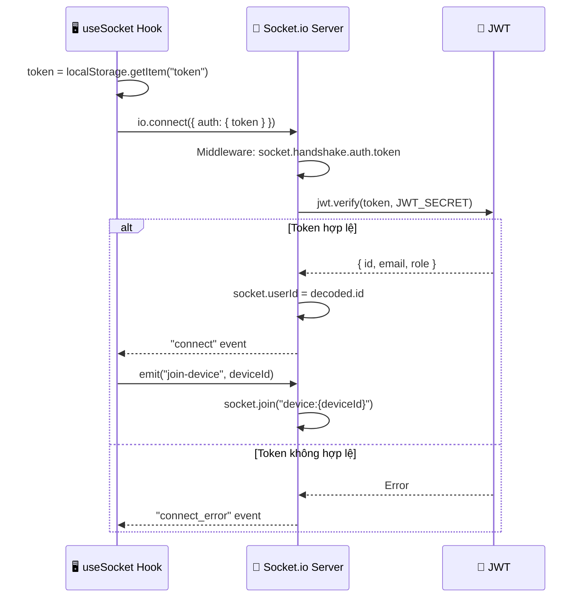

---

## 7. Tổng kết API Endpoints

### Authentication (`/api/auth`)
| Method | Endpoint | Auth | Role | Description |
|--------|----------|------|------|-------------|
| POST | `/api/auth/register` | ❌ | - | Đăng ký tài khoản mới |
| POST | `/api/auth/login` | ❌ | - | Đăng nhập, nhận JWT token |
| GET | `/api/auth/me` | ✅ | - | Lấy thông tin user hiện tại |

### Devices (`/api/devices`)
| Method | Endpoint | Auth | Role | Description |
|--------|----------|------|------|-------------|
| GET | `/api/devices` | ✅ | - | Danh sách thiết bị (filter, paginate) |
| GET | `/api/devices/stats` | ✅ | - | Thống kê thiết bị |
| GET | `/api/devices/:id` | ✅ | - | Chi tiết thiết bị |
| POST | `/api/devices` | ✅ | admin | Tạo thiết bị mới |
| PUT | `/api/devices/:id` | ✅ | admin | Cập nhật thiết bị |
| DELETE | `/api/devices/:id` | ✅ | admin | Xóa thiết bị |
| GET | `/api/devices/:id/data` | ✅ | - | Dữ liệu lịch sử sensor |
| POST | `/api/devices/:id/command` | ✅ | admin | Gửi lệnh điều khiển |

### Groups (`/api/groups`)
| Method | Endpoint | Auth | Role | Description |
|--------|----------|------|------|-------------|
| GET | `/api/groups` | ✅ | - | Danh sách nhóm thiết bị |
| POST | `/api/groups` | ✅ | admin | Tạo nhóm mới |
| PUT | `/api/groups/:id` | ✅ | admin | Cập nhật nhóm |
| DELETE | `/api/groups/:id` | ✅ | admin | Xóa nhóm |
| POST | `/api/groups/:id/devices` | ✅ | admin | Thêm thiết bị vào nhóm |

### Schedules (`/api/schedules`)
| Method | Endpoint | Auth | Role | Description |
|--------|----------|------|------|-------------|
| GET | `/api/schedules` | ✅ | - | Danh sách lịch |
| GET | `/api/schedules/:id` | ✅ | - | Chi tiết lịch |
| POST | `/api/schedules` | ✅ | admin | Tạo lịch mới |
| PUT | `/api/schedules/:id` | ✅ | admin | Cập nhật lịch |
| DELETE | `/api/schedules/:id` | ✅ | admin | Xóa lịch |
| POST | `/api/schedules/:id/execute` | ✅ | admin | Thực thi lịch |

### Notifications (`/api/notifications`)
| Method | Endpoint | Auth | Role | Description |
|--------|----------|------|------|-------------|
| GET | `/api/notifications` | ✅ | - | Danh sách thông báo |
| PUT | `/api/notifications/:id/read` | ✅ | - | Đánh dấu đã đọc |
| PUT | `/api/notifications/read-all` | ✅ | - | Đánh dấu tất cả đã đọc |

### WebSocket Events
| Event | Direction | Room | Description |
|-------|-----------|------|-------------|
| `join-device` | Client → Server | - | Tham gia room theo dõi device |
| `leave-device` | Client → Server | - | Rời room theo dõi device |
| `device:data` | Server → Client | `device:{id}` | Dữ liệu sensor real-time |
| `device:update` | Server → Client | `device:{id}` | Cập nhật trạng thái device |
| `devices:status` | Server → All | broadcast | Cập nhật status toàn cục |
| `device:alert` | Server → All | broadcast | Cảnh báo thiết bị |
